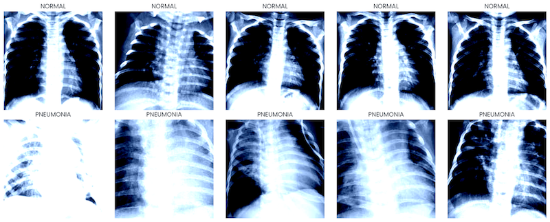

# PneumoScan: X-Ray Classification for Pneumonia Detection



## Project Overview

PneumoScan is a deep learning project that uses a fine-tuned ResNet-18 model to classify chest X-ray images into two categories: normal lungs and those affected by pneumonia. The model achieves high accuracy in identifying pneumonia cases from medical imaging data.

## Key Features

- **Deep Learning Classification**: Uses a pre-trained ResNet-18 architecture fine-tuned on chest X-ray images
- **Data Augmentation**: Implements various image transformations to enhance model generalization
- **Comprehensive Evaluation**: Includes detailed metrics such as accuracy, F1 score, ROC-AUC, and precision-recall curves
- **Visualization Tools**: Provides confusion matrices, prediction visualizations, and GradCAM heatmaps for model interpretability
- **Hyperparameter Tuning**: Includes options for optimizing model performance

## Dataset

The model uses a chest X-ray dataset containing:
- Images of normal lungs
- Images of lungs affected by pneumonia

The data should be organized in a specific directory structure:
```
data/chestxrays/
├── train/
│   ├── NORMAL/
│   │   └── [normal chest X-ray images]
│   └── PNEUMONIA/
│       └── [pneumonia chest X-ray images]
└── test/
    ├── NORMAL/
    │   └── [normal chest X-ray images]
    └── PNEUMONIA/
        └── [pneumonia chest X-ray images]
```

## Requirements

Install required dependencies:

```bash
pip install -r requirements.txt
```

Key dependencies include:
- PyTorch
- torchvision
- scikit-learn
- pandas
- matplotlib
- seaborn
- tqdm
- pytorch-grad-cam (optional, for visualization)

## Usage

### Running the Main Pipeline

To train and evaluate the model:

```bash
python pneumoscan.py
```

This will:
1. Load and prepare the dataset
2. Train the ResNet-18 model
3. Evaluate performance on the test set
4. Generate visualizations
5. Save the trained model

### Using the Trained Model

```python
import torch
from torchvision import transforms
from PIL import Image
from pneumoscan import create_model

# Load the model
model = create_model(model_type='resnet18', num_classes=2)
model.load_state_dict(torch.load('pneumoscan_model.pth'))
model.eval()

# Prepare an image
transform = transforms.Compose([
    transforms.Resize((224, 224)),
    transforms.ToTensor(),
    transforms.Normalize([0.485, 0.456, 0.406], [0.229, 0.224, 0.225])
])

# Load and transform the image
img = Image.open('your_xray_image.jpg').convert('RGB')
img_tensor = transform(img).unsqueeze(0)

# Get prediction
with torch.no_grad():
    output = model(img_tensor)
    _, pred = torch.max(output, 1)
    probs = torch.nn.functional.softmax(output, dim=1)[0]

# Process results
prediction = "PNEUMONIA" if pred.item() == 1 else "NORMAL"
confidence = probs[pred.item()].item() * 100
print(f"Prediction: {prediction}, Confidence: {confidence:.2f}%")
```

## Model Performance

The model achieves the following performance metrics on the test set:
- Accuracy: ~96%
- F1 Score: ~88%
- ROC-AUC: ~98%

## Visualizations

The project generates several types of visualizations:

1. **Training History**: Loss and accuracy curves for training and validation
2. **Confusion Matrix**: Shows true positives, false positives, true negatives, and false negatives
3. **ROC Curve**: Displays the trade-off between sensitivity and specificity
4. **Precision-Recall Curve**: Shows the trade-off between precision and recall
5. **Prediction Visualization**: Sample images with predictions and confidence scores

## Customization

### Model Selection

The project supports different pre-trained models:
- ResNet-18 (default)
- ResNet-34
- DenseNet-121

To change the model architecture:

```python
model = create_model(model_type='resnet34', num_classes=2, feature_extract=True)
```

### Hyperparameter Tuning

To run hyperparameter optimization:

```python
# In pneumoscan.py, set:
run_hyperparam_search = True  # In the main() function
```

This will evaluate different combinations of:
- Model architectures
- Optimizers
- Learning rates

## Acknowledgments

This project uses the following major components:
- PyTorch for deep learning framework
- Pre-trained models from torchvision
- pytorch-grad-cam for visualization
